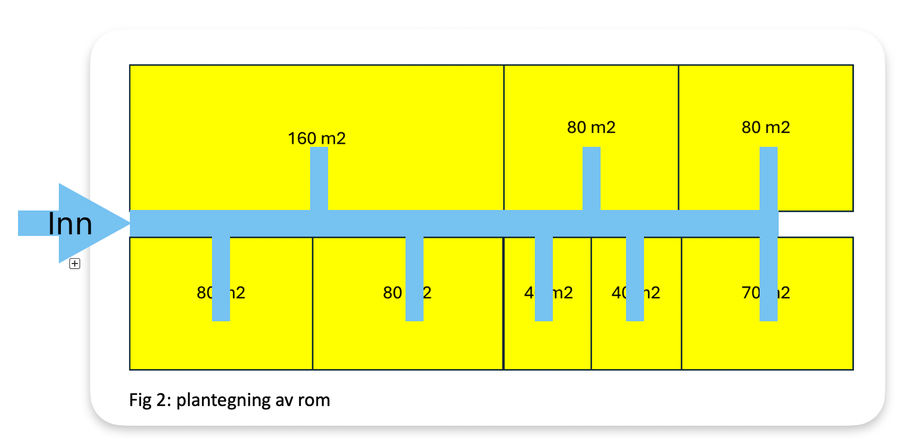
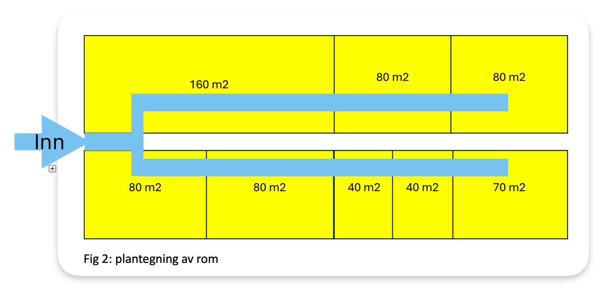

# TSM2450 Oblig 1

- Emne: Termo- og fluidmekanikk
- Tid: Vår 2025 USN Porsgrunn
- Repo: https://github.com/Arxcis/TSM2450-oblig1

## 1. Olje/vann-separator

### 1.1 Trykk i bunn av tanken

Pythonskript viser utregning av trykket i bunnen av tanken. Bruker ligning for hydrostatisk trykk - $\Delta P = \rho g y$

```py
rho_vann = 1000 # kg/m3
rho_olje = 800  # kg/m3
H_olje   = 0.2  # m
H_vann   = 0.8  # m
g        = 9.81 # m/s**2

P_atmosfære = 101_000 # Pa
P_olje      = rho_olje * g * H_olje
P_vann      = rho_vann * g * H_vann

P_over = P_olje + P_vann
P_abs  = P_olje + P_vann + P_atmosfære
```

#### Demo av skript

```bash
jonas@pop-os:~/git/TSM2450-termo-og-fluid$ python oppg1.py

    Oppg1 svar:

        P_atmos =   101000.0 Pa
        P_olje  =     1569.6 Pa
        P_vann  =     7848.0 Pa
        P_over  =     9417.6 Pa
        P_abs   =   110417.6 Pa
```

## 2. Ventilasjon av klasserom

### 2.1 Plantegning


### 2.3 Mål og krav

Ønsker å finne ut hvilken konfigurasjon av rør som gir lavest totalpris på ventilasjonsanlegget

Det stilles 4 krav:

1. Nominell luftstrøm per person: $Q_{nominell} = 26 m^3/s/pers$
2. Maksimal lufthastighet: $V_{max} = 10m/s$
3. Nominell persontetthet: $Persontetthet = 0.7pers/m^2$
4. Det skal brukes hyllevarer.

### 2.4 Hyllevarer

En liste med hyllevarer er oppgitt med ulike tverrsnitt på rør, men ikke prisen. Det er fra denne tabellen at et utvalg av rør skal velges og konfigureres på en måte som tilfredstiller kravene til ventilasjon.


### 2.5 Rørvolum

Det antas at det totale rørvolumet, vil være proporsjonal med prisen. Dermed blir målet å finne det lavest totale rørvolumet.

Total rørvolum defineres til å være:

```math
    Total \ volum = \sum_{i}^{n}Rør_{i,volum} = \sum_{i}^{n}Rør_{i,lengde} \cdot Rør_{i,tverrsnitt}
```

Her er en pseudokode i python:

```py
total_volum = 0
for rør in røra:
    total_volum += rør.lengde * rør.tverrsnitt
```

### 2.6 Alternativer for konfigurasjon av rør

Ønsker å sammenligne 4 ulike konfigurasjoner, for å finne ut hvilken som gir lavest rørvolum.

#### Alternativ A: Trestruktur inn fra vest



#### Alternativ B: Trestruktur inn fra øst


#### Alternativ C: Trestruktur inn fra tak i midten


#### Alternativ D: Gaffel inn fra vest



### 2.7 Metode

Metoden som brukes er å kjøre et pythonskript for å gjøre beregninger for hvert av de 4 alternativene. Skriptet svarer med en totallengde og et totalvolum for hvert alternativ.

Pesudokode til skriptet:

```pseudokode
for hvert rør:
    1. Regn ut antall personer som røret skal føre luft til.
    2. Regn ut Q som røret må ha, for å forsyne antall personer.
    3. Regn ut minste tverrsnitt som røret må ha, for å forsyne Q.
    4. Velg hyllevare som er nærmest minste tverrsnitt.
    5. Regn ut rørvolum som er rørlengde * hylletverrsnitt.

Summer rørvolumet, rølengde og antall rør.
```

### 2.8 Resultat

```bash
jonas ~/git/TSM2450-oblig1 $ python oppg2.py
                           Antall rør  Rørlengde [m]  Rørvolum [m2]
A: Trestruktur fra vest            15           74.5        10.6355
B: Trestruktur fra øst             15           74.5        10.6105
C: Trestruktur fra midten          11           71.0         8.7750
D: Gaffel fra vest                  9           77.5        10.1600
```

#### 2.9 Konklusjon

Resultat fra beregning av alternativ A og B, viser at det ikke har noe å si om en forsyner fra øst eller vest. Begge gir eksakt samme rørlengde, samme antall rør og tilnærmet lik rørvolum, men det skal sies at østre alternativ (B) har 0.02 m3 mindre volum enn A.

Alternativ C med trestruktur fra taket i midten, gir klart minst rørvolum - 82% av A og B. C gir også 4 færre rør og 3.5 meter kortere total rørlengde.

Alternativ D er alternativet med færrest rør, men lengst total rørlengde. Rørvolum er midt i mellom - 95% av A og B og 115% av C.

Mest sannsynlig er det alternativ C eller D som blir billigst. Hvilken av de to avhenger av, om det er rørvolum, rørlengde eller antall rør som er kostnadsdriveren.
