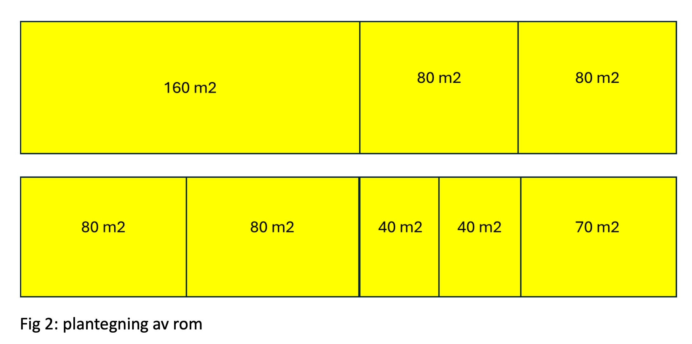
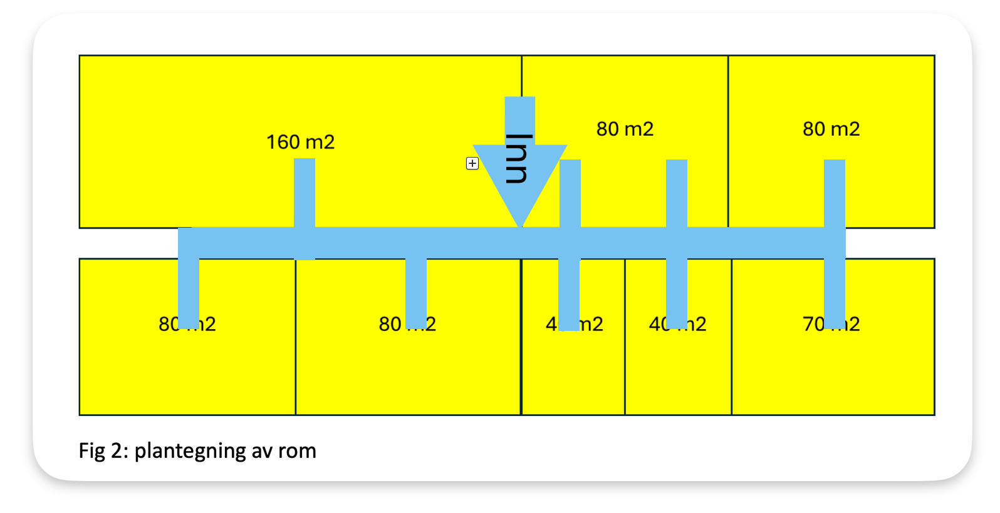

# TSM2450 Oblig 1

- Emne: Termo- og fluidmekanikk
- Tid: Vår 2025 USN Porsgrunn
- Repo: https://github.com/Arxcis/TSM2450-oblig1

## 1. Olje/vann-separator

### 1.1 Trykk i bunn av tanken

Pythonskript viser utregning av trykket i bunnen av tanken. Bruker ligning for hydrostatisk trykk - $\Delta P = \rho g y$

```py

```

#### 1.2 Demo av skript

```bash
jonas@pop-os:~/git/TSM2450-termo-og-fluid$ python oppg1.py

    Oppg1:

    Det skal kjøpes en olje/vann-separator lik den i bildet under. Det blå er vann (i bunn) og det beige er olje. Fra nær bunn går det ett rør oppover til å se nivået i tanken.

        a) Dersom oljen har en tetthet på 800 kg/m3 og har en høyde på 20cm, hva er da trykket i bunn av tanken om trykket i gassen i toppen er atmosfærisk?


        Svar:
          P_atmos =   101000.0 Pa
          P_olje  =     1569.6 Pa
          P_vann  =     7848.0 Pa
          P_over  =     9417.6 Pa
          P_abs   =   110417.6 Pa
```

## 2. Ventilasjon av klasserom

### 2.1 Plantegning



### 2.3 Mål og krav

Ønsker å finne ut hvilken konfigurasjon av rør som gir lavest totalpris på ventilasjonsanlegget

Det stilles 4 krav:

1. Nominell luftstrøm per person: $Q_{nominell} = 26 m^3/s/pers$
2. Maksimal lufthastighet: $V_{max} = 10m/s$
3. Nominell persontetthet: $Persontetthet = 0.7pers/m^2$
4. Det skal brukes hyllevarer.

### 2.4 Hyllevarer

En liste med hyllevarer er oppgitt med ulike tverrsnitt på rør, men ikke prisen. Det er fra denne tabellen at et utvalg av rør skal velges og konfigureres på en måte som tilfredstiller kravene til ventilasjon.


### 2.5 Rørvolum

Det antas at det totale rørvolumet, vil være proporsjonal med prisen. Dermed blir målet å finne det lavest totale rørvolumet.

Total rørvolum defineres til å være:

```math
    Total \ volum = \sum_{i}^{n}Rør_{i,volum} = \sum_{i}^{n}Rør_{i,lengde} \cdot Rør_{i,tverrsnitt}
```

Her er en pseudokode i python:

```py
total_volum = 0
for rør in røra:
    total_volum += rør.lengde * rør.tverrsnitt
```

### 2.6 Alternativer for konfigurasjon av rør

Ønsker å sammenligne 4 ulike konfigurasjoner, for å finne ut hvilken som gir lavest rørvolum.

**Alternativ A: Trestruktur inn fra vest**

**Alternativ B: Trestruktur inn fra øst**

**Alternativ C: Trestruktur inn fra tak i midten**

**Alternativ D: Gaffel inn fra vest**


Sammenligningstabell:

| Alternativ         | Lengde | Volum |
| ------------------ | ------ | ----- |
| A: tre fra vest    | ?      | ?     |
| B: Tre fra øst     | ?      | ?     |
| C: Tre fra midt    | ?      | ?     |
| D: Gaffel fra vest | ?      | ?     |

### 2.7 Beregning av Q_inn

Krav til luftstrøm per pers settes til 26 m3/t og det er krav til at en skal tilby luft til 0.7personer per m2. På et romareal på 630m2 gir det oss 441 personer. 441 personer trenger (26 \* 441) m3/t = 11 466 m3/t eller 11 466 m3/t / 3600 s/t = 3.185 m3/s.

### 2.8 Valg av rør

Rør er hyllevare. Beregningene gir et minste tverrsnitt for å tilfredstille krav til v_max og Q_per_pers_per_sekund.

```math
 A_{minste} =  \frac{Q_{inn}}{v_{max}}
```

Da gjelder det å finne en hyllevare som er større, men så nærmt som mulig minste tverrsnitt.

Python-funksjon viser hvordan rør velges fra tabell:

```py
def velg_hylletvare(A_min: float):
    """
    A_min: float - minsteverdi for ønske av rør. Velger tilsvarende rør eller nærmeste rør som er større enn denne verdien.
    """

    for i, A_hylle in enumerate(sorted(HYLLE)):
        if A_min < A_hylle:
            return A_hylle, None

    return None, f"Fant ingen hyllevare som har stort nok tverrsnitt til: {A_min} m2"
```

### 2.9 Resultater

| Alternativ         | Lengde | Volum |
| ------------------ | ------ | ----- |
| A: tre fra vest    | ?      | ?     |
| B: Tre fra øst     | ?      | ?     |
| C: Tre fra midt    | ?      | ?     |
| D: Gaffel fra vest | ?      | ?     |

### 2.10 Demo av skript

```bash
jonas ~/git/TSM2450-oblig1 $ python oppg2.py

#
# Oppg2 svar:
#

Innstillinger:
    V max            =     10.0 m/s
    Q luft per time  =     26.0 m3/person/t

                Lengde [m]  Areal [m2]
    hoved              1.5         630
    vestre            15.0         320
    vestre 160         5.0         160
    vestre 80          5.0          80
    vestre 80          5.0          80
    østre             15.0         310
    østre 80           5.0          80
    østre 80           5.0          80
    østre 70           4.5          70
    østre 40           5.0          40

Beregninger:
    Q luft per sekund = 0.0072 m3/person/s

    Total personer  =    441 stk
    Total romareal  = 630.00 m2
    Total rørlengde =  66.00 m
    Total rørvolum  =   8.62 m3

                Personer  Q [m3/s]  A min [m2]  A hylle [m2]  len [m]  volum [m3]  v hylle [m/s]
    hoved            441     3.185       0.319         0.503      1.5       0.754          6.332
    vestre           224     1.618       0.162         0.196     15.0       2.940          8.254
    vestre 160       112     0.809       0.081         0.126      5.0       0.630          6.420
    vestre 80         56     0.404       0.040         0.049      5.0       0.245          8.254
    vestre 80         56     0.404       0.040         0.049      5.0       0.245          8.254
    østre            217     1.567       0.157         0.196     15.0       2.940          7.996
    østre 80          56     0.404       0.040         0.049      5.0       0.245          8.254
    østre 80          56     0.404       0.040         0.049      5.0       0.245          8.254
    østre 70          49     0.354       0.035         0.049      4.5       0.221          7.222
    østre 40          28     0.202       0.020         0.031      5.0       0.155          6.523
```
